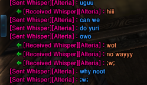

### **Intro**

Customizes the color of whispers based on context.

#### Usage

* Edit `settings.json` to colorize:
  * `me` - your whispers.
  * `friends` - your friends whispers.
  * `others` - other peoples whispers 
  * `particular` - name specific whispers.
	
`particular` target can be stated both with a **single string** or an **array of strings**. There's examples inside the file if you have no idea what all of this means, just try to follow the syntax.

*What's a hex color?? halp: https://www.hexcolortool.com/*

#### Commands

* ***`cw`***  *`[on/off]`* - turns on and off the module.
######
* ***`cw`*** *`[me/friends/others/particular]` `[on/off]`* turns on and off the specified option.
######
* ***`cw`*** ***`color`*** *`#hexcolor`* - prints a little message to test colors in-game.

#### Credits

* All the people i randomly whispered when testing.
* TerableCoder for the friend coloring.
* In general anyone working in tera-proxy that makes this possible.
